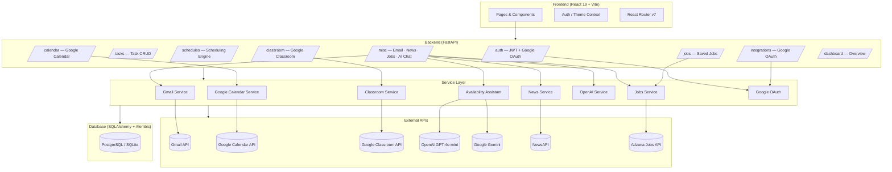
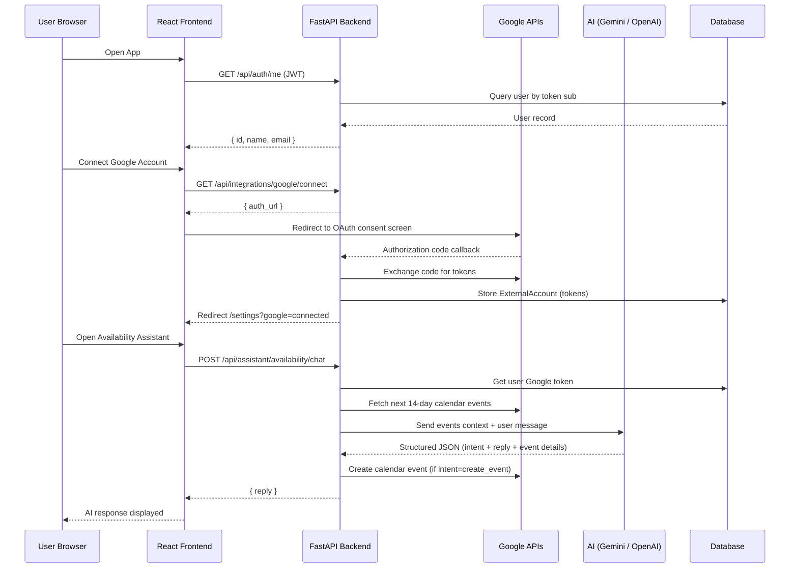

<div align="center">

# 🧠 AlignAI — Smart Personal Assistant

**One dashboard. Every tool you need to stay productive, connected, and ahead.**

[](https://python.org)
[](https://fastapi.tiangolo.com)
[](https://react.dev)
[](https://typescriptlang.org)
[](https://tailwindcss.com)
[](LICENSE)
[](CONTRIBUTING.md)

</div>

---

## What is AlignAI?

AlignAI is a full-stack smart personal assistant built for students and professionals who are tired of context-switching between ten different tabs. It unifies your **Gmail**, **Google Calendar**, **Google Classroom**, job hunting, daily news, task management, and AI-powered scheduling — all in a single, dark-themed, beautifully minimal interface.

> [!NOTE]
> AlignAI is a **Software Engineering semester project** developed with a production-quality architecture: typed Python backend, React 19 frontend, OAuth 2.0 Google integration, JWT authentication, and LLM-powered features via OpenAI GPT-4o-mini and Google Gemini.

---

## Demo


> _Replace placeholder paths above with actual screenshots once captured._

---

## Feature Highlights

| Module | What it Does |
|---|---|
| **Dashboard** | Unified overview — pending tasks, upcoming deadlines, AI suggestions, productivity score |
| **Task Manager** | Full CRUD with AI-calculated priority (due date + progress → high/medium/low) |
| **Schedule Manager** | Conflict-detected scheduling + available-slot finder |
| **Smart Email** | Read, star, mark-read, send Gmail, and draft AI replies via OpenAI |
| **Google Calendar** | View and create events synced to your Google Calendar |
| **Google Classroom** | Pending coursework tracker with urgency priority (≤2 days → 🔴 high) |
| **Job Finder** | Search 25M+ live jobs via Adzuna API, save favourites to your profile |
| **Daily News** | Curated, category-filtered news digest via NewsAPI (5-min in-process cache) |
| **Availability Assistant** | Natural-language AI chatbot to query and book calendar slots (Gemini + GPT fallback) |
| **Career Profile** | Store skills, goals, interests and get AI-generated career recommendations |
| **Settings** | Manage Google integrations, notification preferences, and account details |

---

## System Architecture



---

## Data Flow



---

## Tech Stack

### Backend

| Layer | Technology |
|---|---|
| **Framework** | FastAPI 0.135 + Uvicorn 0.42 |
| **ORM** | SQLAlchemy 2.0 + Alembic migrations |
| **Database** | PostgreSQL (prod) / SQLite (dev) |
| **Auth** | JWT (python-jose) + bcrypt (passlib) |
| **AI / LLM** | LangChain + OpenAI GPT-4o-mini + Google Gemini 2.0 Flash |
| **Google APIs** | Gmail, Google Calendar, Google Classroom (OAuth 2.0) |
| **External Data** | NewsAPI, Adzuna Jobs API |
| **Validation** | Pydantic v2 + pydantic-settings |
| **Retry Logic** | tenacity (exponential back-off on LLM calls) |

### Frontend

| Layer | Technology |
|---|---|
| **Framework** | React 19 + TypeScript 5.9 |
| **Bundler** | Vite 8 |
| **Styling** | Tailwind CSS 4 + shadcn/ui (Radix UI primitives) |
| **Routing** | React Router DOM v7 |
| **Charts** | Recharts 3 |
| **Animations** | Motion (Framer Motion v12) |
| **Drag & Drop** | react-dnd 16 |
| **Forms** | react-hook-form 7 |
| **Notifications** | Sonner |
| **Testing** | Playwright |

---

## Directory Structure

```
Smart-Personal-Assistant/
│
├── Backend/
│   ├── main.py                     # FastAPI app entry point + CORS
│   ├── requirements.txt
│   ├── .env                        # Environment variables (never commit!)
│   ├── alembic/                    # Database migrations
│   │   └── versions/               # Migration scripts (0001–0003)
│   └── app/
│       ├── config/
│       │   └── settings.py         # Pydantic-Settings config (reads .env)
│       ├── database/
│       │   └── session.py          # SQLAlchemy engine + session factory
│       ├── models/
│       │   └── entities.py         # All ORM models (User, Task, Schedule, …)
│       ├── schemas/
│       │   └── dto.py              # Pydantic request/response models
│       ├── routes/                 # One router per domain
│       │   ├── auth_routes.py          # JWT signup / login / logout
│       │   ├── auth_google_routes.py   # Google Sign-In OAuth
│       │   ├── task_routes.py
│       │   ├── schedule_routes.py
│       │   ├── career_routes.py
│       │   ├── dashboard_routes.py
│       │   ├── calendar_routes.py
│       │   ├── classroom_routes.py
│       │   ├── jobs_routes.py
│       │   ├── location_routes.py
│       │   ├── study_routes.py
│       │   ├── integrations_google_routes.py   # OAuth token storage
│       │   └── misc_routes.py      # Email · News · Jobs · AI Chat · Settings
│       ├── services/               # Business logic + external API clients
│       │   ├── gmail_service.py
│       │   ├── google_calendar_service.py
│       │   ├── classroom_service.py
│       │   ├── google_oauth.py
│       │   ├── jobs_service.py
│       │   ├── news_service.py
│       │   ├── openai_service.py
│       │   ├── availability_assistant.py   # LLM scheduling chatbot
│       │   └── priority.py         # Task priority calculator
│       └── utils/
│           ├── deps.py             # FastAPI dependencies (get_current_user)
│           └── security.py        # JWT create/decode, password hashing
│
└── frontend/
    ├── index.html
    ├── vite.config.ts
    ├── tailwind.config.ts
    ├── playwright.config.ts
    └── src/
        ├── App.tsx                 # Root component, route definitions
        ├── main.tsx
        ├── pages/                  # One file per route
        │   ├── LandingPage.tsx
        │   ├── LoginPage.tsx
        │   ├── SignUpPage.tsx
        │   ├── DashboardPage.tsx
        │   ├── SmartEmailPage.tsx
        │   ├── CalendarPage.tsx
        │   ├── ClassroomPendingWorkPage.tsx
        │   ├── JobFinderPage.tsx
        │   ├── DailyNewsPage.tsx
        │   ├── AvailabilityManagerPage.tsx
        │   ├── SettingsPage.tsx
        │   └── GoogleOAuthCallbackPage.tsx
        ├── app/
        │   ├── components/         # Layout, Sidebar, progress bar
        │   └── context/            # AuthContext, ThemeContext, useAuth hook
        └── components/
            └── ui/                 # shadcn/ui component library
```

---

## Getting Started

### Prerequisites

- **Python** 3.11+
- **Node.js** 18+ and **npm**
- **PostgreSQL** (or use SQLite for local dev — zero config)
- API keys (see [Environment Variables](#environment-variables))

---

### 1. Clone the Repository

```bash
git clone https://github.com/AbdulRehmanAntall/Smart-Personal-Assistant.git
cd Smart-Personal-Assistant
```

---

### 2. Backend Setup

```bash
cd Backend

# Create and activate a virtual environment
python -m venv venv
# Windows
venv\Scripts\activate
# macOS / Linux
source venv/bin/activate

# Install dependencies
pip install -r requirements.txt

# Copy the environment template and fill in your keys
cp .env.example .env
```

#### Run database migrations

```bash
alembic upgrade head
```

#### Start the development server

```bash
uvicorn main:app --reload --port 8000
```

The API is now live at `http://127.0.0.1:8000`.  
Interactive Swagger docs: `http://127.0.0.1:8000/docs`

---

### 3. Frontend Setup

```bash
cd ../frontend

# Install dependencies
npm install

# Start the dev server
npm run dev
```

The app is now live at `http://localhost:5173`.

---

## Environment Variables

Create `Backend/.env` with the values below. **Never commit real secrets.**

```dotenv
# ── App ───────────────────────────────────────────────────
SECRET_KEY=change-me-in-production
DATABASE_URL=sqlite:///./app.db          # swap for postgresql+psycopg2://... in prod
FRONTEND_ORIGIN=http://localhost:5173

# ── AI Providers ─────────────────────────────────────────
OPENAI_API_KEY=sk-...
OPENAI_MODEL=gpt-4o-mini

GEMINI_API_KEY=AIza...
GEMINI_MODEL=models/gemini-2.0-flash

# ── Google OAuth (Gmail · Calendar · Classroom) ──────────
GOOGLE_CLIENT_ID=...apps.googleusercontent.com
GOOGLE_CLIENT_SECRET=GOCSPX-...
GOOGLE_REDIRECT_URL=http://127.0.0.1:8000/api/integrations/google/callback
GOOGLE_AUTH_REDIRECT_URL=http://127.0.0.1:8000/api/auth/google/callback

# ── External APIs ─────────────────────────────────────────
NEWS_API_KEY=...              # newsapi.org
ADZUNA_APP_ID=...             # adzuna.com
ADZUNA_APP_KEY=...
ADZUNA_COUNTRY=us             # e.g. gb, pk, au
```

> [!TIP]
> For Google credentials, create an OAuth 2.0 client in the Google Cloud Console and enable the **Gmail API**, **Google Calendar API**, and **Google Classroom API**. Add both callback URLs above as authorized redirect URIs.

---

## API Reference

All routes are prefixed with `/api`.

### Authentication (`/api/auth`)

| Method | Endpoint | Description |
|---|---|---|
| `POST` | `/auth/signup` | Register with name, email, password |
| `POST` | `/auth/login` | Login → returns access + refresh tokens |
| `POST` | `/auth/refresh` | Exchange refresh token for new access token |
| `POST` | `/auth/logout` | Revoke current access token |
| `GET` | `/auth/me` | Get authenticated user profile |
| `GET` | `/auth/google/login` | Initiate Google Sign-In flow |
| `GET` | `/auth/google/callback` | Google Sign-In OAuth callback |

### Tasks (`/api/tasks`)

| Method | Endpoint | Description |
|---|---|---|
| `GET` | `/tasks` | List all tasks for current user |
| `POST` | `/tasks` | Create task (priority auto-calculated) |
| `PATCH` | `/tasks/{id}` | Update task fields |
| `DELETE` | `/tasks/{id}` | Delete task |
| `POST` | `/tasks/{id}/complete` | Mark task complete (progress → 100) |

### Schedules (`/api/schedules`)

| Method | Endpoint | Description |
|---|---|---|
| `GET` | `/schedules` | List schedules |
| `POST` | `/schedules` | Create schedule (409 on conflict) |
| `GET` | `/schedules/available-slots` | Find free slots (`from_at`, `to_at`, `duration_minutes`) |

### Google Integration (`/api/integrations`)

| Method | Endpoint | Description |
|---|---|---|
| `GET` | `/integrations/status` | Check Google connection status |
| `GET` | `/integrations/google/connect` | Get Google OAuth authorization URL |
| `GET` | `/integrations/google/callback` | Handle OAuth callback, store tokens |
| `POST` | `/integrations/google/disconnect` | Remove stored Google tokens |

### Email / News / Jobs / AI Chat

| Method | Endpoint | Description |
|---|---|---|
| `GET` | `/emails` | List Gmail inbox (25 messages, 60s cache) |
| `GET` | `/emails/{id}` | Full email with decoded body |
| `POST` | `/emails/{id}/star` | Star / unstar email |
| `POST` | `/emails/{id}/mark-read` | Mark read / unread |
| `POST` | `/emails/{id}/draft-reply` | AI-drafted reply via OpenAI |
| `POST` | `/emails/send` | Send email via Gmail API |
| `GET` | `/news?category=AI` | Filtered news articles (5-min cache) |
| `GET` | `/jobs?q=python&location=US` | Search live jobs via Adzuna |
| `GET` | `/jobs/saved` | List saved jobs |
| `POST` | `/jobs/{id}/save` | Save a job |
| `DELETE` | `/jobs/{id}/save` | Remove saved job |
| `POST` | `/assistant/availability/chat` | AI scheduling chat (Gemini → OpenAI fallback) |

---

## Roadmap

### Implemented

- [x] JWT authentication (signup, login, refresh, logout)
- [x] Google OAuth 2.0 Sign-In and account linking
- [x] Dashboard with tasks, deadlines, and AI suggestions
- [x] Task management with AI-calculated priority
- [x] Conflict-detecting schedule manager with free-slot finder
- [x] Gmail integration — read, send, star, mark-read, AI draft
- [x] Google Calendar — view and create events
- [x] Google Classroom — pending coursework with urgency sorting
- [x] Job Finder via Adzuna API with save/unsave
- [x] Daily News feed via NewsAPI with category filter
- [x] Availability Assistant (LLM-powered natural language scheduling)
- [x] Career profile + AI recommendations
- [x] Dark/light theme toggle
- [x] Playwright E2E test suite

### Planned

- [ ] Mobile-responsive redesign and PWA support
- [ ] Push notifications for task deadlines and calendar reminders
- [ ] File upload for study materials with AI-powered Q&A
- [ ] Multi-provider calendar support (Outlook / Apple Calendar)
- [ ] Pomodoro timer integrated with the task tracker
- [ ] Team / collaboration mode (shared tasks and schedules)
- [ ] AI email triage and smart inbox categorization
- [ ] Productivity analytics with weekly reports

---

## Running Tests

```bash
cd frontend

# Install Playwright browsers (first time only)
npx playwright install

# Run the full E2E test suite
npx playwright test

# View the HTML report
npx playwright show-report
```

---

## Contributing

Contributions are welcome. Here is how to get started:

1. Fork the repository
2. Create a feature branch: `git checkout -b feature/your-feature`
3. Commit your changes: `git commit -m "feat: add your feature"`
4. Push to your fork: `git push origin feature/your-feature`
5. Open a Pull Request against `main`

> [!NOTE]
> Please keep PRs focused — one feature or fix per PR makes review much faster.

---

## License

This project is licensed under the **MIT License**. See [LICENSE](LICENSE) for details.

---

<div align="center">

Built with passion as a **Software Engineering Semester Project** · FAST NUCES

</div>
